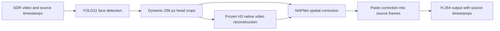

# FlashH3VR

**Flash H3 Video Restoration** · H3-based portrait video restoration

[简体中文](README.zh-CN.md) · [Usage and assets](docs/USAGE.md) · [Measured baseline](docs/BASELINE.md) · [Licensing](THIRD_PARTY_NOTICES.md)

FlashH3VR combines a frozen MiniMax H3 video VAE, dynamic head crops, and a small adapted NAFNet tail to restore portrait video. The current research path preserves source timestamps and applies spatial corrections back to the original frame.

**This is a research source release. The adapted checkpoint, pretrained weights, datasets, and demonstration footage are not included. A fresh clone cannot reproduce the reported restoration output without the missing assets.** Model and data licensing is separate from the source-code license; see [asset availability](docs/ASSETS.md).

## Current pipeline



- YOLO11m-face, FP32, input size 960; two independent workers with batch size 16.
- Input decoding overlaps detection; direct BGR preparation and execution reuse reduce host overhead.
- H3 uses the pinned INT8 ConvRot weights and Comfy Kitchen CUDA INT8 kernels, with native 22-frame chunks and 5-frame overlap.
- A frozen NAFNet-GoPro width-32 backbone supplies features to a 199,747-parameter adapted tail; inference batch size is 8.
- The accepted model is the **balanced 32-step checkpoint**. Later spatial experiments were not adopted.

## Measured results

Historical measurements on an **NVIDIA RTX PRO 6000 Blackwell 96 GB**, Windows, with a **60-frame / 60 fps / 768 × 432** input:

| Observation | Processing time, excluding loading | Throughput | Loading |
|---|---:|---:|---:|
| Accepted historical baseline, September 11 | 2.440212 s | 24.588 FPS | 4.953044 s |
| Closure check with resource sampling, September 12 | 2.539637 s | 23.625 FPS | 6.314069 s |

Each row is one complete pass, not a repeated-run average. Throughput is processed frames per wall-clock second; the input remains 60 fps. These results do not establish streaming latency, real-time 60 fps operation, or performance on other GPUs.

The closure output matched the accepted output byte for byte, including the MP4. During that check, whole-machine CPU averaged **13.01%**, device GPU utilization averaged **52.21%** and peaked at **99%**. Framework allocated/reserved GPU memory peaked at **6.190 / 9.785 GiB**. Device-wide memory, including background applications, peaked at **13.223 GiB**.

On the historical Johnny evaluation, LPIPS improved **5.848%** and high-frequency error improved **1.211%** relative to the degraded input. This is a limited evaluation, not evidence of general superiority. See [definitions, limitations and checkpoint identity](docs/BASELINE.md).

## Install and run CPU tests

Python 3.12 is the recorded development environment. Create an isolated environment, install PyTorch and torchvision appropriate to your platform, then:

```bash
python -m pip install -e ".[dev,video,models]"
python -m pytest -q
```

The published tests use synthetic inputs and CPU checks; they do not download pretrained weights or establish end-to-end model quality. The [recorded Windows GPU environment](requirements.gpu.lock.txt) is a historical lock, not a cross-platform installer.

The Python import namespace remains `h3ce` for source continuity; the distribution and display name are **FlashH3VR**. The legacy `h3ce` command covers older engineering workflows. It is **not** a ready-made entry point for the accepted NAF inference path. Use the [research API documentation](docs/USAGE.md).

## Scope and next steps

The research stage is closed at the accepted configuration. Temporal optimization and exploratory training are paused. Existing H3 temporal behavior, geometry handling, and timestamps remain part of inference.

Current limitations include silent SDR input only, eligible head segments requiring a unique sufficiently large face, finite frame limits and memory-resident processing. The current path rejects audio instead of silently discarding it. It is not a general full-frame repair or super-resolution product.

Priorities for a later release are resolving checkpoint distribution rights, a portable inference CLI, audio handling and broader hardware validation. Character LoRA integration for this NAF path and 512-pixel head inference remain separate unfinished items.

## Source layout

| Location | Contents |
|---|---|
| `h3ce/data/` | Video/color handling, detection, geometry and input preparation |
| `h3ce/infer/` | Native H3 head sequence and file inference |
| `h3ce/vae/` | H3 bridge, verified loading and INT8 integration |
| `h3ce/train/`, `h3ce/lora/` | Training/checkpoint and earlier engineering components |
| `scripts/research_naf_head3.py` | Current NAF tail and inference wrapper |
| `scripts/closure_resource_monitor.py` | CPU/process-tree/NVML resource sampler |
| `scripts/` | Shared helpers and selected historical run recipes |
| `tests/` | Published CPU regression tests |

Historical run recipes reference private experiment receipts and caches that are not distributed. They are retained for source transparency, not as fresh-clone commands. See [release scope](docs/RELEASE_SCOPE.md).

## License and attribution

Project-owned source code is licensed under **GNU AGPL-3.0-only**. Vendored AI Toolkit and NAFNet/BasicSR source retains its original notices and licenses. External model weights, CUDA libraries and datasets are not relicensed by this repository.

See [LICENSE](LICENSE), [NOTICE](NOTICE) and [THIRD_PARTY_NOTICES.md](THIRD_PARTY_NOTICES.md). FlashH3VR is an independent project and does not imply endorsement by the upstream authors.
